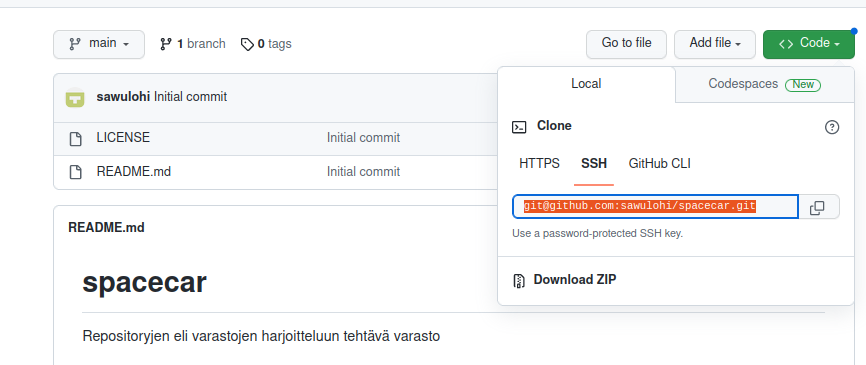

# h3 Git

Testaukset tehty VirtualBoxin kautta Ubuntu 22.04 LTS-distrolla. Git on jo asennettu testikoneelle:

		$ sudo apt-get update
		$ sudo apt-get install git

## a) MarkDown. Tee tämän tehtävän raportti MarkDownina. Helpointa on tehdä raportti GitHub-varastoon, jolloin md-päätteiset tiedostot muotoillaan automaattisesti. Tyhjä rivi tekee kappalejaon, risuaita ‘#’ tekee otsikon, sisennys merkitsee koodinpätkän.

Tein tämän raportin MarkDownina. Katsoin ohjeita esimerkiksi [tältä sivulta](https://www.markdownguide.org/cheat-sheet/).
Esimerkiksi edellinen linkki onnistui MarkDownilla seuraavasti:

		[HALUTTU TEKSTI LINKKIIN](weppisivun osoite)

Kuvien lisäämistä ajattelin testata myöhemmissä kohdissa harjoitustehtävää (syntaksi on sama kuin linkissä, mutta lisätään huutomerkki (!) ennen []-sulkuja. Koska aioin lopulta lisätä raportin GitHubiin, tein koodiblokkien tabuloinnit kahdella tabuloinnilla (yksi ei aina vaikutattanut riittävän jostain syystä). Vaihtoehtoisesti koodiblokkeihin voisi käyttää kolmea backtickkiä (`) koodiblokin alussa ja lopussa.

## b) Offline. Tee paikallinen offline-varasto git:llä. Varaston nimessä tulee olla sana "cat" (kissa). Aiemmin tehty varasto ei siis kelpaa. Aseta itsellesi sähköpostiosoite ja nimi. Näytä varastollasi muutosten teko ja niiden katsominen lokista.

Loin paikallisen offline-varaston:

		~$ git init kittycat

Lisäksi halusin vaihtaa oppitunnilla säätämäni sähköpostiosoitteen ja nimen, tämä onnistui seuraavanlaisesti:

		$ git config --global --list

Tuolla komennolla sain listauksen gittiin asetetusta sähköpostista ja nimestä. Niitä muuttaakseni voisin käyttää komentoa `git config --global user.name $NIMI`ja `git config --global user.email $SPOSTI`. Kokeilin näitä, ja uudelleen tiedot listatessa käytäjän nimiin oli jäänyt vielä vanha nimi. Googlasin hieman ja sain tietää, että git säilöö asetukset lokaalisti kotihakemistoon .gitconfig-tiedostoon [askubuntu.com](https://askubuntu.com/questions/206449/git-config-global-file-remove-settings). Avasin sen:

		~$ nano .gitconfig

Muokkasin tiedostosta halutut asiat ja tallensin asetukset. Sitten tarkastin muutokset uudelleen:

		git config --global --list

		
Näiden asetusten jälkeen loin varastoon ensimmäisen tiedoston, README.md:

		~$cd kittycat/
		$ nano README.md

Tiedoston luomisesta tehdään muutosten teko, kommentointi sekä lokihistorian selaaminen seuraavasti:

		$ git add .
		$ git commit
		Lisätään avautuvaan tekstitiedostoon tehty muutos preesensissä, imperatiivissa.
		
		$git log --patch

Komentoriviin tulostuu seuraavanlainen näkymä:

Lokista näkee esim. muutoksen tekijän (author), muutoksen ajankohdan (date). Näiden jälkeen on commit-tiedoston sisältö, tässä tapauksessa "Make the initial README.md file"
Tämän lisäksi lokitiedosto näyttää tiedostojen lisäykset tai muutokset.

## c) Doh! Tee tyhmä muutos gittiin, älä tee commit:tia. Tuhoa huonot muutokset ‘git reset --hard’. Huomaa, että tässä toiminnossa ei ole peruutusnappia.

Tyhmänä muutoksena poistin koko README.md-tiedoston. Lisäksi loin testimielessä uuden tiedoston, sotku.md:

		$ rm README.md
		$ ls #tarkastin, että kansio oli tyhjä poistamisen jälkeen
		$ nano sotku.md
		$ git reset --hard
		

Nähtävästi uusi luotu tiedosto jäi sellaisenaan varastoon, mutta komento myös palautti poistetun README.md-tiedoston. Kätevää!

## d) Online. Tee uusi varasto GitHubiin (tai Gitlabiin tai mihin vain vastaavaan palveluun). Varaston nimessä ja lyhyessä kuvauksessa tulee olla sana "car" (auto). Aiemmin tehty varasto ei kelpaa. (Muista tehdä varastoon tiedostoja luomisvaiheessa, suosittelen tekemään README.md ja vapaista lisensseistä itse tykkään GPLv3 eli GNU General Public License, version 3)

Tein harjoitusvaraston [GitHubiin](https://github.com). Minulla on sivustolle tunnukset, joten kirjauduin weppiselaimella sisään ja suunnistin etusivulta uuden repositoryn luontisivuille. Tein tehtävänannon mukaiset asetukset, ja loin varaston:

 

## e)  Dolly. Kloonaa edellisessä kohdassa tehty varasto itsellesi, tee muutoksia, puske ne palvelimelle, ja näytä, että ne ilmestyvät weppiliittymään.

Githubista repositoryjen kloonaaminen onnistuu siten, että varastoon otetaan yhteys esim. ssh:n avulla. Tätä varten tarvitaan julkinen ssh-avain, jonka loin ja yhdistin tiliini aiemmin 10.11. pidetyllä luennolla.  Tarvitsin myös varaston osoitteen, jonka sain varaston sivuilta "Code"-painikkeen alapuolelta:

Sitten otin yhteyden varastoon ja kloonasin sen koneelleni:

		~$ git clone git@github.com:sawulohi/spacecar.git
		~$ cd spacecar/

Tein muutoksia README.md-tiedostoon sekä loin foo.py-tiedoston. Sitten puskin muutokset githubiin:

		$ nano README.md
		$ nano foo.py
		$ git add . && git commit; git pull; git push

README.md-tiedostoon tuli näkyviin tehtyjä muutoksia varaston "kotisivulla". Myös tiedostojen kohdalla näkyi uusin commit-kommentointi (Make changes to README.md, create foo.py)
[Kotitehtävässä käytetty varasto on vielä näkyvillä, jos haluat tarkastella muutoslokeja lähemmin](https://github.com/sawulohi/spacecar)

#### Lähteet:
[https://askubuntu.com/questions/206449/git-config-global-file-remove-settings](https://askubuntu.com/questions/206449/git-config-global-file-remove-settings)
[https://www.markdownguide.org/cheat-sheet/](https://www.markdownguide.org/cheat-sheet/)
